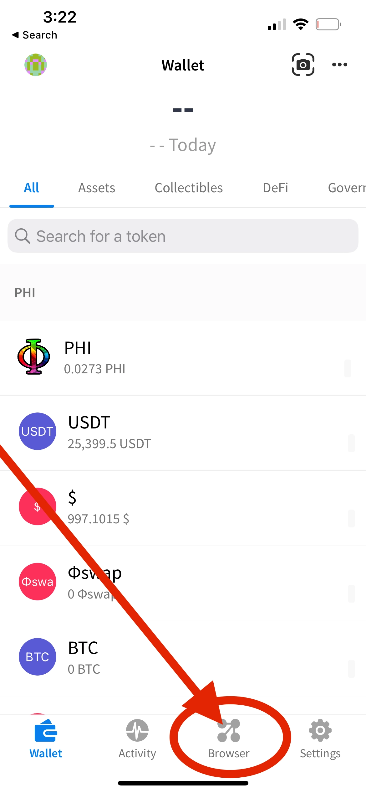

# 📱 dApp Browser


Prerequisite: 

​[Alpha Wallet](https://docs.phi.network/phi-wiki/use-phi-smart-chain/compatible-wallets/create-smart-chain-wallet/additional-compatible-wallets-setup/alpha-wallet-setup) Must Be Installed

[PHI Network](https://docs.phi.network/phi-wiki/use-phi-smart-chain/compatible-wallets/create-smart-chain-wallet/additional-compatible-wallets-setup#phi-smart-chain-v2-connection-details) Added To Alpha Wallet


In Order To Use Decentralized Applications On Your Mobile Device You Will Need To A dApp Browser. 

You can Access The dApp Browser Within Alpha Wallet By Following The Visual Aids Below.

<figure><figcaption>
Click Browser In Bottom Menu
</figcaption></figure>

 

<figure><figcaption>
Enter Url Of dApp
</figcaption></figure>


Enter The Url Of the dApp You Want To Access. When Your Accessing A dApp Within Alpha Wallet When You Click "Metamask" Labels It Will Function Within Alpha Wallet Not Metamask.



When Using Alpha Wallet or Any Compatible Web3 Wallet For The First Time Select You Already Have a Wallet & Use Your 12 Word Phrase or Private Key From Your [Kojib Wallet.](https://wallet.kojib.com)&#x20;



Congratulations You've Learned How To Access A dApp Browser.


### Use Case For dApp Browser:

You Will Need To Use A dApp Browser To Connect To The Governance dApp to Vote & Create New Proposals On Your Mobile Device.&#x20;


Alternatively You Can Access Via Your Desktop/Laptop Using [Metamask](https://metamask.io/) Chrome Extension.&#x20;


