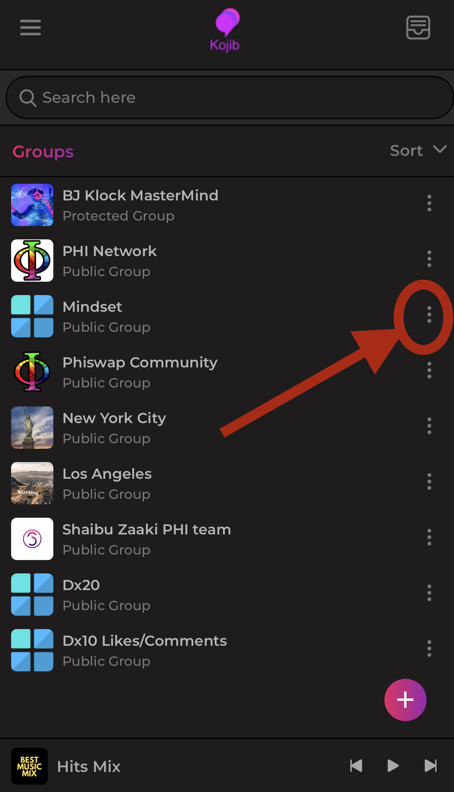
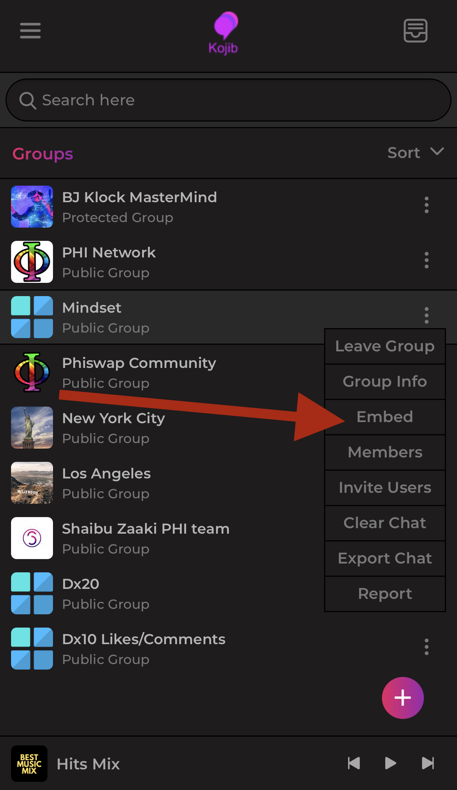
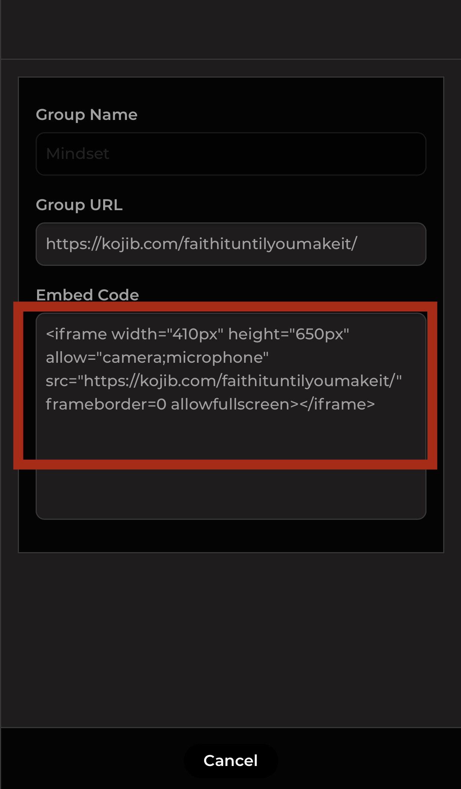

# 👩❤👨 Embed Group Chats

To easily embed Kojib chats onto your own website using the embed code, simply copy the code provided by Kojib and paste it into the HTML source code of your website on the page you want the group to show.&#x20;

How To Get The Embeddable Code Of A Group:

<figure><figcaption>
Click The Three Dots To The Right Of The Group Chat You Want To Embed.
</figcaption></figure>

 

<figure><figcaption>
Click Embed
</figcaption></figure>

 

<figure><figcaption>
Copy The Iframe Code &#x26; Paste It Into Your Websites Code Where You Want The Group Chat To Appear. 
</figcaption></figure>

Once you've embedded the code, the chat will appear on your website.
